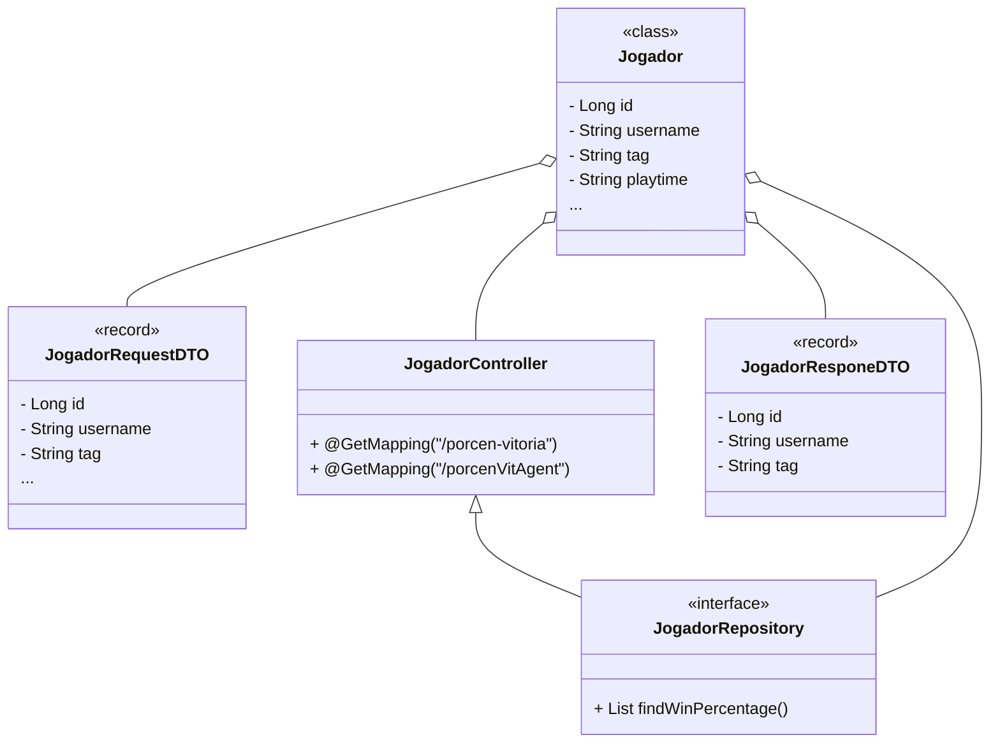
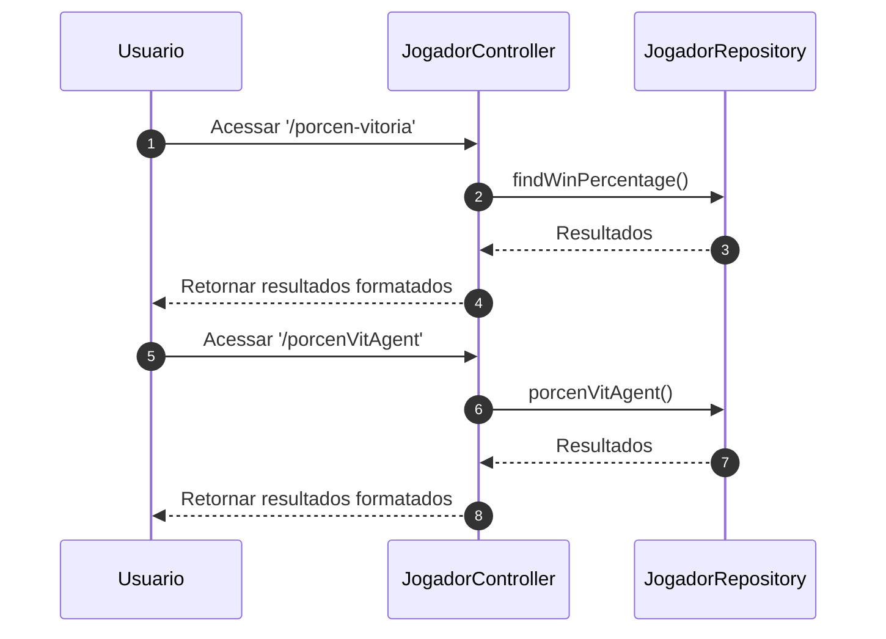
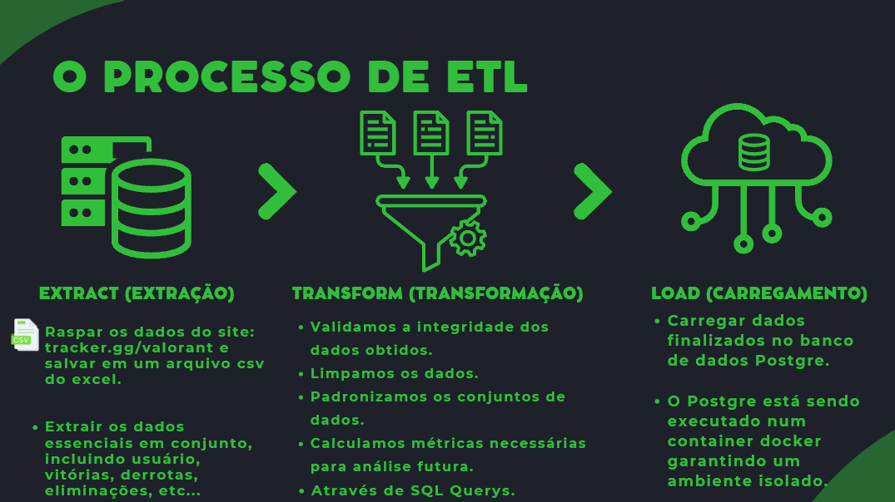

## Descrição da Arquitetura do Sistema de Gerenciamento de Jogadores de Valorant

Jogador: Esta classe representa os dados de um jogador, como seu identificador único (id), nome de usuário (username), tag, tempo de jogo (playtime), entre outros atributos. É uma entidade persistente no banco de dados.

JogadorRepository: Esta é uma interface que define operações para acessar e manipular os dados dos jogadores no banco de dados. No diagrama, apenas uma operação findWinPercentage() é mostrada, que retorna uma lista de arrays de objetos contendo informações sobre a porcentagem de vitória de cada jogador.

JogadorRequestDTO: Esta classe representa um objeto de transferência de dados (DTO) usado para receber dados do cliente para criar ou atualizar um jogador. Contém os mesmos atributos que a classe Jogador, mas é utilizada para comunicação com o cliente.

JogadorController: Este é um controlador que lida com requisições HTTP relacionadas aos jogadores. Ele possui dois métodos mapeados para as URLs /porcen-vitoria e /porcenVitAgent, indicados pelo annotation @GetMapping. Esses métodos são responsáveis por receber requisições do cliente e delegar o processamento para os componentes apropriados.

JogadorResponeDTO: Similar ao JogadorRequestDTO, este é um objeto de transferência de dados usado para enviar dados do servidor para o cliente em resposta a uma requisição. Ele contém os mesmos atributos que a classe Jogador, mas é utilizado para comunicação com o cliente.

Exemplo de uso dessa abordagem no microsserviço **Jogadores**:

#### Interação entre User, JogadorController, e JogadorRepository

O diagrama de sequência apresentado descreve a interação entre os diferentes componentes de um sistema em dois cenários distintos. No primeiro cenário, o usuário acessa a porcentagem de vitória dos jogadores através do endpoint '/porcen-vitoria'. O controlador de jogador (JogadorController) recebe a solicitação e, em seguida, chama o método findWinPercentage() no repositório de jogador (JogadorRepository) para recuperar os dados da porcentagem de vitória. O repositório executa a operação e retorna os resultados ao controlador, que os formata e os retorna ao usuário. No segundo cenário, o usuário acessa a porcentagem de vitória do agente através do endpoint '/porcenVitAgent'.

#### O Processo de ETL

A extração de dados do site tracker.gg/valorant utilizando técnicas de web scraping para obter informações relevantes, como estatísticas de jogadores e partidas, em formato CSV. Em seguida, esses dados são importados para um banco de dados PostgreSQL usando a estrutura Spring Boot, que simplifica o desenvolvimento de aplicativos Java e a integração com bancos de dados. O projeto abrange diversas disciplinas, desde o desenvolvimento web até a ciência de dados, e o fluxo de dados ocorre da web para o aplicativo Spring Boot e, por fim, para o banco de dados PostgreSQL.

